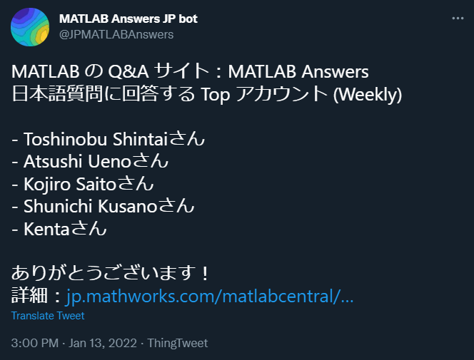
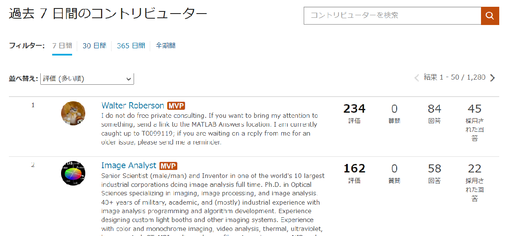
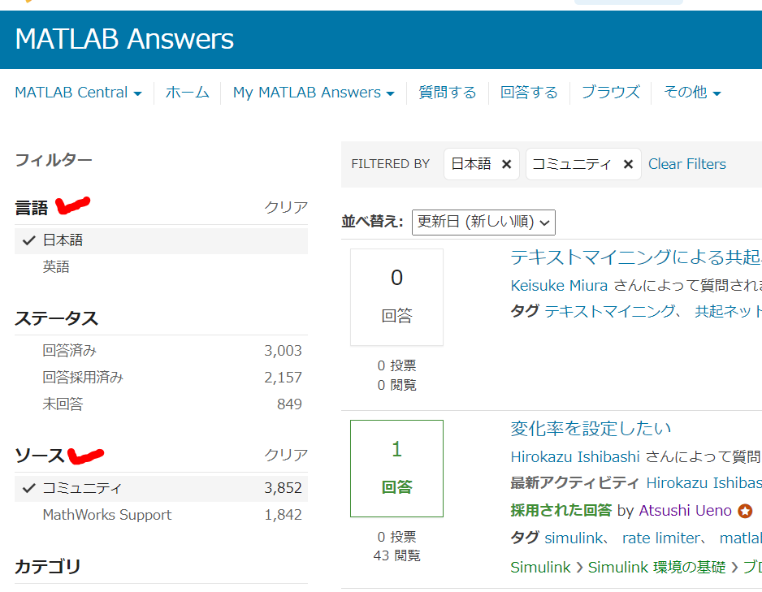
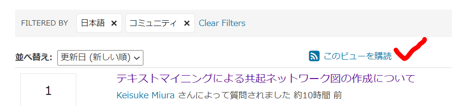

# 日本語の質問に回答してくれるのは誰？

Copyright (c) 2022 The MathWorks, Inc.

MATLAB 関連の質問をするなら MATLAB Answers ですが、回答してくれているのってどんな方だろう？

MATLAB Answers 全体のランキングは用意されていますが日本語に絞ると？

  

ということで日本語の質問に応えてくれている方を探し出すことにします。最終的に [ThingSpeak](https://thingspeak.com/) も使って週間ランキングは Twitter の Bot [@MATLABAnswers](https://twitter.com/JPMATLABAnswers/) から呟くように設定します。



  
# まずは現状確認

MATLAB Answers の UI を確認します。

## 貢献度ランキング

まずこれ、コントリビューターリスト。



週間、月間、年間の貢献度ランキングがあります。ちなみにこの "評価" という数字は

   -  自分の回答が採用される4 ポイント 
   -  自分の回答に投票される2 ポイント 
   -  自分の質問に投票される1 ポイント 

という形で数値化されてまして、ポイントがたまると質問、回答、およびコメントの編集や削除などもできるようになります。詳細は[こちら](https://jp.mathworks.com/matlabcentral/answers/help?s_tid=gn_mlc_ans_hlp#reputation)にあります。

  
## 日本語への回答者は？

残念ながら上のランキングでは日本語の質問に回答してくれているかどうかを判別することはできません。そもそも日本語と英語両方に回答している場合考えると日本語フィルタ―は現実的ではないですね。

  
## 質問ページを調査する

質問ページを見てみます。こちらには日本語フィルタがありますね。そして MathWorks Support フィルタ。これは公式サポートチームが FAQ として公開しているものをさします。それ以外のポストはすべて ”コミュニティ" になります。

  



各ページには〇〇さんによって質問された、◇◇さんが回答したなどの情報があるので、これを吸い上げればいいかもしれません。

  
# それでどうしたか？

   1.  一定期間内に更新された日本語の質問ページを抽出 
   1.  それらに関わるアカウント名を集計 
   1.  ランキング上位者を見つける 

こんな感じですね。例えば週間ランキングであれば、過去１週間に更新のあった、すなわち回答やコメントが付いた、ページを対象にすればいいですね。

例えば「[テキストマイニングに�よる共起ネットワーク�図の作成について](https://jp.mathworks.com/matlabcentral/answers/1628370-)」のソースを見ると

```matlab:Code(Display)
href="/matlabcentral/profile/authors/2229289">Keisuke Miura</a>
href="/matlabcentral/profile/authors/14080697">Misa Taguchi</a>
```

と Keisuke Miura さんと Misa Taguchi さんの名前が出てきます。これを正規表現を使って抽出してみます。

  

まずは１から順番に。

## 1. 一定期間内に更新された日本語の質問ページを抽出

日本語・コミュニティの 2 つのフィルターを適用したページを開きます。「このビューを購読」すると RSS フィードが確認できます。RSS（RDF Site Summary/Rich Site Summary）はデータ形式の一種で、Webサイト内の新着ページや更新ページのタイトルや URL、更新日時、要約などを一覧形式で取得できるので便利。



XML 形式になっていますので、[xmlread 関数](https://jp.mathworks.com/help/matlab/ref/xmlread.html)を使います。

```matlab:Code
xDoc = xmlread(['https://jp.mathworks.com/matlabcentral/answers' ...
            '/questions?language=ja&format=atom&sort=updated+desc&status=answered' ...
            '&page=1']);
```

MATLAB Answers の場合は 1 ページあたり 50 個しか情報が含まれないので、`page=1` とページ番号を振って過去にさかのぼっていきます。

欲しい情報だけを取り出していきます（中身の確認が面倒・・）

```matlab:Code
% まず各投稿は <entry></entry>
allListitems = xDoc.getElementsByTagName('entry');

% アイテム数だけ配列を確保
title = strings(allListitems.getLength,1); % タイトル
url = strings(allListitems.getLength,1); % URL
author = strings(allListitems.getLength,1); % 投稿者
updated = strings(allListitems.getLength,1); % 最終更新日時

% 各アイテムから title, url, author 情報を出します。
for k = 0:allListitems.getLength-1
    thisListitem = allListitems.item(k);

    % Get the title element
    thisList = thisListitem.getElementsByTagName('title');
    thisElement = thisList.item(0);
    % The text is in the first child node.
    title(k+1) = string(thisElement.getFirstChild.getData);

    % Get the link element
    thisList = thisListitem.getElementsByTagName('link');
    thisElement = thisList.item(0);
    % The url is one of the attributes
    url(k+1) = string(thisElement.getAttributes.item(0));

    % Get the author element
    thisList = thisListitem.getElementsByTagName('author');
    thisElement = thisList.item(0);
    childNodes = thisElement.getChildNodes;
    author(k+1) = string(childNodes.item(1).getFirstChild.getData);

    % Get the <updated>2020-04-18T16:40:12Z</updated>
    thisList = thisListitem.getElementsByTagName('updated');
    thisElement = thisList.item(0);
    updated(k+1) = string(thisElement.getFirstChild.getData);

end

% 日時データは datetime 型に変換しておきます。
updated_at = datetime(updated,'InputFormat', "uuuu-MM-dd'T'HH:mm:ss'Z");
updated_at.Format = 'uuuu-MM-dd HH:mm:ss';

% URL は以下の形になっているので、
% href="https://www.mathworks.com/matlabcentral/answers/477845-bode-simulink-360"
url = extractBetween(url,"href=""",""""); % URL 部分だけ取得
entryID = double(extractBetween(url,"answers/","-")); % 投稿IDを別途確保
```

ここまでの情報をテーブルにまとめると以下の通り。

```matlab:Code
tmp = timetable(title, url, author, 'RowTimes', updated_at,...
    'VariableNames',{'titles', 'urls', 'authors'})
```

| |Time|titles|urls|authors|
|:--:|:--:|:--:|:--:|:--:|
|1|2022-01-14 00:26:48|"テキストマイニングによる共起ネットワー...|"https://www.mathwor...|"Keisuke Miura"|
|2|2022-01-13 13:44:56|"変化率を設定したい"|"https://www.mathwor...|"Hirokazu Ishibashi"|
|3|2022-01-13 13:41:04|"白飛びを除いたL*a*b*値を求めたい...|"https://www.mathwor...|"touka kakihara"|
|4|2022-01-13 09:59:12|"Windows システム上で MATL...|"https://www.mathwor...|"MathWorks Support T...|
|5|2022-01-13 09:32:48|"【グラフの作成】Y軸の値からX軸の値を...|"https://www.mathwor...|"RK"|
|6|2022-01-13 08:48:56|"【値の判別】データ内の値が、閾値より変...|"https://www.mathwor...|"RK"|
|7|2022-01-13 05:33:25|"tcpclient コマンドと、tcp...|"https://www.mathwor...|"MathWorks Support T...|
|8|2022-01-13 05:27:12|"License Manager Err...|"https://www.mathwor...|"MathWorks Support T...|
|9|2022-01-13 04:59:25|"macOS 10.14(Mojave)...|"https://www.mathwor...|"MathWorks Support T...|
|10|2022-01-13 00:47:22|"アカデミックライセンスを学生でも購入す...|"https://www.mathwor...|"凌太 中野"|
|11|2022-01-13 00:14:41|"License Manager Err...|"https://www.mathwor...|"MathWorks Support T...|
|12|2022-01-12 23:43:03|"License Manager Err...|"https://www.mathwor...|"MathWorks Support T...|
|13|2022-01-12 07:06:17|"複数の異なる数値配列を含む構造体を M...|"https://www.mathwor...|"MathWorks Support T...|
|14|2022-01-12 06:59:06|"Spring and Damper F...|"https://www.mathwor...|"taichi muto"|

イイ感じ。

後は各 URL に対して関連アカウントを探してくる作業を行います。

## 2. それらに関わるアカウント名を集計

例として1つ目の質問を見てみましょう。

名前は

```matlab:Code(Display)
href="/matlabcentral/profile/authors/14080697">Misa Taguchi</a>
```

と出ているはずなので、

```matlab:Code(Display)
regexp(txt,'href="/matlabcentral/profile/authors/(?:\d+?)">([^<].+?)</a>','tokens');
```

で行けるはず。

```matlab:Code
url = tmp.urls(1)
```

```text:Output
url = "https://www.mathworks.com/matlabcentral/answers/1628370-"
```

```matlab:Code
txt = webread(url);
users_on_post = regexp(txt,'href="/matlabcentral/profile/authors/(?:\d+?)">([^<].+?)</a>','tokens');
string(users_on_post)'
```

```text:Output
ans = 3x1 string    
"Keisuke M…  
"Misa Tagu…  
"Misa Tagu…  

```

イイ感じ。2 回登場していますが、これは `unique` 関数を噛ましておけばOKでしょう。

## 3. ランキング上位者を見つける

例えば週間ランキングページの URL は

```matlab:Code
baseURL = "https://jp.mathworks.com/matlabcentral/answers/contributors/?filter=week";
```

こんな様子です。これも各ページ 50 人の表示なので、それ以上の情報をとる場合は page を使います。

試しに上位 250 人を抽出するならこんな感じ。HTML ファイルをいじるなら [webread 関数](https://jp.mathworks.com/help/matlab/ref/webread.html)からの [htmlTree 関数](https://jp.mathworks.com/help/textanalytics/ref/htmltree.html)。これは [Text Analytics Toolbox](https://jp.mathworks.com/products/text-analytics.html) が必要ですが、要素を抽出するのに便利です。がんばれば正規表現で対応できそうですけども。

この辺は HTML のソースとにらめっこしながら欲しい情報がどこにあるか調べながらコードに落とし込みます。

```matlab:Code
perpage = 50; % ページ当たりの人数
pages = 1; % 5 ページ確認します（合計 250 人）
ranks = zeros(perpage*pages,1);
names = strings(perpage*pages,1);
for ii=1:pages
    url = baseURL + "&page=" + ii;
    
    a = webread(url);
    b = htmlTree(a);
    c = findElement(b,"td:first-child");
    
    for jj=1:perpage
        index = (ii-1)*perpage+jj;
        % 順位
        tmp = findElement(c(jj),"div:first-child");
        ranks(index) = extractHTMLText(tmp);
        % アカウント名
        tmp = findElement(c(jj),"H4 > A > SPAN");
        names(index) = extractHTMLText(tmp);
    end
    
end
names
```

```text:Output
names = 50x1 string    
"Walter Roberson"     
"Image Analyst"       
"Star Strider"        
"Cris LaPierre"       
"KSSV"                
"John D'Errico"       
"Benjamin"            
"MathWorks Support …  
"DGM"                 
"Matt J"              

```

そして上で抽出した日本語の質問に関連するアカウントを [ismember 関数](https://jp.mathworks.com/help/matlab/ref/double.ismember.html)で抽出します。

```matlab:Code
idx = ismember(names,nicknames);
dataset = table(ranks(idx),names(idx),'VariableNames',{'rank','nickname'})
```

| |rank|nickname|
|:--:|:--:|:--:|
|1|23|"Atsushi Ueno"|
|2|37|"Kojiro Saito"|
|3|38|"Toshinobu Shintai"|
|4|45|"Shunichi Kusano"|

これは実行時の結果ですので、これを読まれている時点ではまた違う結果になっていると思います。

あとは Twitter への投稿文を構成して、後は呟くだけ！

```matlab:Code
status = "MATLAB の Q&A サイト：MATLAB Answers" + newline;
status = status + "日本語質問に回答する Top アカウント (" + period + ")" + newline + newline;

for ii=1:min(height(dataset),5)
    status = status + "- " + dataset.nickname(ii) + "さん" + newline;
end
status = status + newline + "ありがとうございます！" + newline;
status = status + "詳細："  + baseURL;
disp(status);
```

```text:Output
MATLAB の Q&A サイト：MATLAB Answers
日本語質問に回答する Top アカウント (Weekly)

- Atsushi Uenoさん
- Kojiro Saitoさん
- Toshinobu Shintaiさん
- Shunichi Kusanoさん

ありがとうございます！
詳細：https://jp.mathworks.com/matlabcentral/answers/contributors/?filter=week
```

できあがり。

コード全体は `tweetRanking_JP.m` を見てください。

***
*Generated from README.mlx with [Live Script to Markdown Converter](https://github.com/roslovets/Live-Script-to-Markdown-Converter)*
